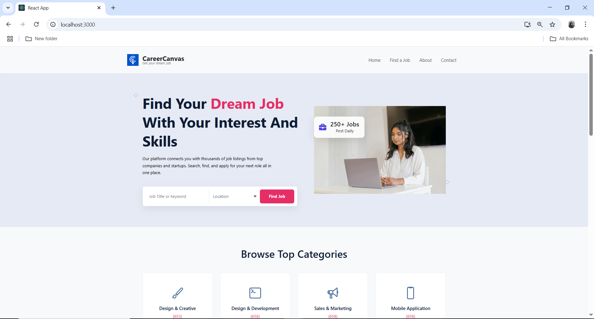
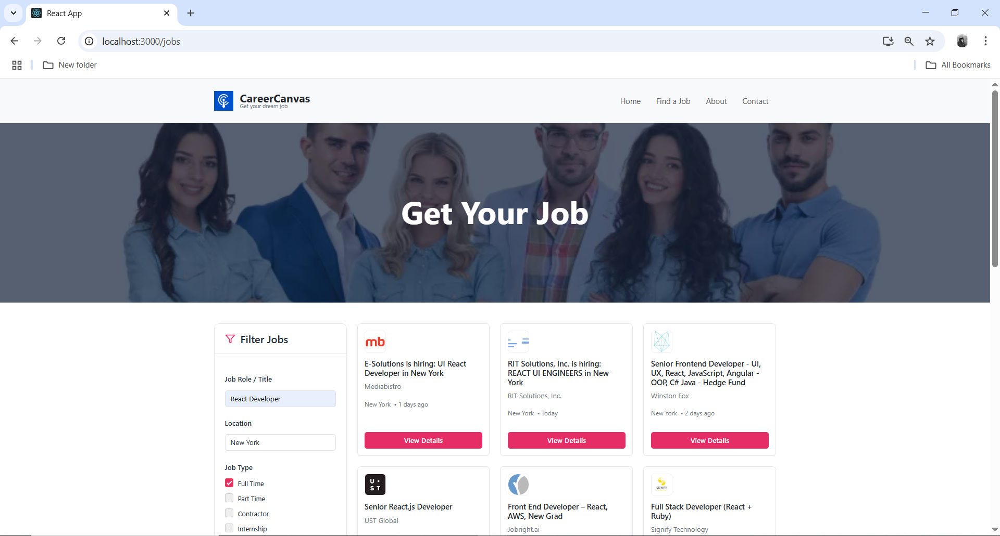
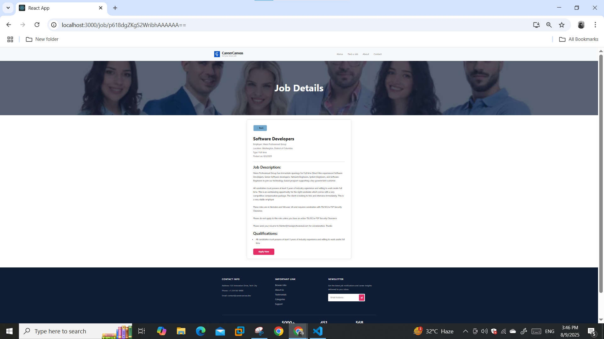
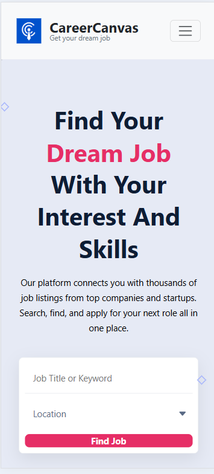

# CareerCanvas - A Modern Job Portal React Application

CareerCanvas is a responsive, feature-rich job portal built with React. It provides a seamless user experience for searching, filtering, and viewing job listings fetched from a live API. The project showcases a clean architecture, modern UI/UX principles, and efficient state management.

---

### Video Walkthrough

A brief walkthrough demonstrating the application's core user flow, from searching on the homepage to applying filters and viewing job details.

_(To get the link for your video, drag and drop the `careercanvas-demo.mp4` file into a comment on a GitHub issue or into this README editor, and GitHub will generate a URL for it.)_

**[PASTE YOUR GITHUB VIDEO LINK HERE]**

---

### Key Features & Screenshots

**1. Dynamic Homepage & Hero Search**
A clean, welcoming landing page that immediately allows users to perform a primary job search.



**2. Advanced Job Filtering & Search Results**
A dedicated jobs page with a multi-faceted filtering system and a clean, card-based layout for search results.



**3. Detailed Job Information**
A dedicated details page for each job, providing comprehensive information and a direct link to the application page.



**4. Fully Responsive Design**
The entire application is fully responsive, providing a seamless experience on all devices, from mobile phones to desktops.



---

### What I Have Done (Technical Implementation)

This project was built from the ground up to be a full-featured, modern web application. Here's a detailed breakdown of the implementation:

*   **I built a dynamic and interactive frontend using React.js,** leveraging its component-based architecture to create a modular and maintainable codebase for features like the Job Cards, Filters, and Headers.

*   **I implemented seamless client-side routing with React Router,** creating a true single-page application (SPA) experience that allows users to navigate between Home, Jobs, About, and Contact pages without page reloads.

*   **I managed complex application state using custom React Hooks.** I created `useJobSearch` and `useJobDetails` to handle asynchronous API calls, manage loading and error states, and efficiently fetch data from a live API.

*   **I integrated the live JSearch API using Axios** to fetch real-time job listings. This process included securely managing API keys via environment variables to protect sensitive information.

*   **I developed a comprehensive, multi-faceted filtering system** that allows users to refine job searches by job title, location, employment type, experience level, and date posted, providing a powerful and intuitive user experience.

*   **I crafted a fully responsive UI using modern CSS,** including Flexbox, Grid, and media queries to ensure the application is visually appealing and fully functional on all devices.

*   **I enhanced the UI with third-party libraries** like **React-Bootstrap** for a robust and accessible navigation bar and **React-Icons** for a clean and modern icon set throughout the application.

*   **I designed the project with a clean and scalable component-based architecture,** separating code into logical folders for `pages`, `components`, `hooks`, and `assets`, making the project easy to navigate and expand.

---

### How To Run Locally

1.  **Clone the repository:**
    ```sh
    git clone https://github.com/NasiraRiaz/JOB-PORTAL.git
    ```
2.  **Navigate to the project directory:**
    ```sh
    cd JOB-PORTAL
    ```
3.  **Install dependencies:**
    ```sh
    npm install
    ```
4.  **Create a `.env` file** in the root of the project and add your JSearch API key:
    ```    REACT_APP_JSEARCH_API_KEY=your_api_key_here
    ```
5.  **Start the development server:**
    ```sh
    npm start
    ```

The application will be running on `http://localhost:3000`.